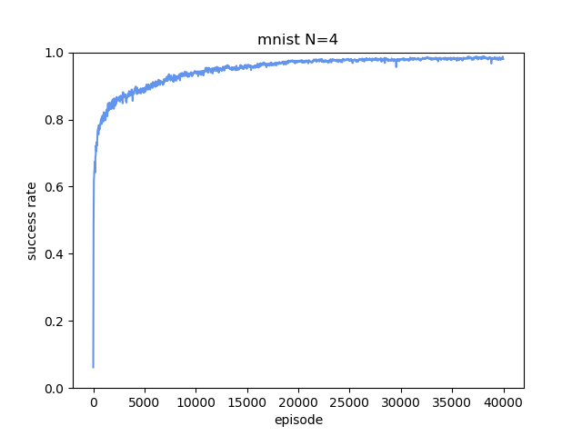
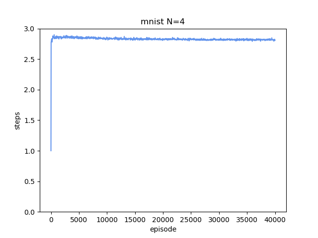
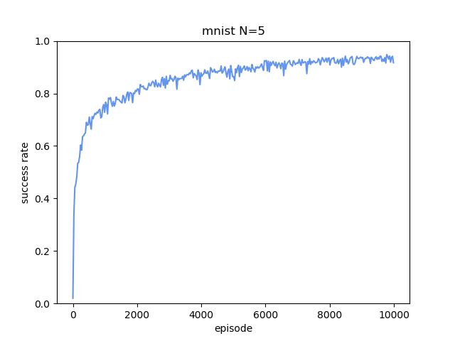
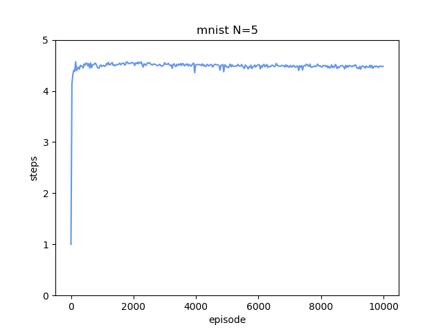

# MNIST sorting

## Task
n個の数字の画像が入力され，隣同士の数字を入れ替えるという行動をして，昇順にソートをする．これをDQNを用いて学習を行う．  
MNISTの数字の画像n個が入力のstateとなり，出力をn-1つのactionとする．
```
s_t = (d_0, d_1, ..., d_n)
a_t = (a_0, a_1, ..., a_(n-1))

s_t: d_0, d_1, ..., d_n はMNISTの画像が1枚ずつ入る
a_n: d_nとd_(n+1)を入れ替える
```

DQNを用いて学習を行う．  
stateが数字の列がソートされているとき，報酬1をもらい，それ以外では報酬0となる．  
n個の数字は，ランダムに選ばれ，n個の数字が同じである場合(ゾロ目)を除き，ソートが完了していない順にランダムに並べられる．
つまり，s_0がソートされている状態であることない．  
割引率gamma < 1設定する．(gamma=1の代わりに，ソートが完了した時以外の即時報酬に負の値を設定するということも考えられる．)

## Requirement
condaの環境
[env.yaml](./env.yaml)  

ソートをするための環境は[env.py](./env.py)に書かれている．ただし，pytorchのtensorを使った学習を想定している．  
DQNの学習については全て[dqn.py](./dqn.py)に書かれている．

## Usage
### 使用例

```
import torch
import dqn

device = torch.device("cuda" if torch.cuda.is_available() else "cpu") 
model_dict = {'digit':dqn.DQN_DIGIT(), 'mnist':dqn.DQN_MNIST()}

chosen_model = 'mnist'      # 'mnist' or 'digit

learning = dqn.Learning(device, chosen_model, model_dict[chosen_model])
learning.training(EPOCH=1)
```

modeはmnistとdigitがある．mnistは入力がmnistの数字の画像であり，digitの場合は数字がそのまま入力となる．

### [main.py](./main.py)
実行例．実行方法は以下の通り．

```
$ python main.py
```

学習を実行するとディレクトリが作られ，そこにデータが保存される．  
設定はsetting(mnist).txtまたはsetting(digit).txtに書かれる．  
学習経過のデータ，ネットワークのパラメータ等のデータはmodel*.pthに保存される．*には保存されたときの学習の合計のエピソード数が記録される．  

## Result examples
### 4個のMNIST画像が入力される時の学習結果
以下の結果は，上の実行例の通りに実行をしたときに得ることができる．  
#### テストデータでのソート成功率

#### テストデータでのソートが成功したなかでの行動数の平均

   

### 5個のMNIST画像が入力される時の学習結果
以下の結果は，[main.py](./main.py)の9行目をdigit=5に，15行目のreplay memoryのサイズrを5から6にして，上の実行例の通りに実行をしたときに得ることができる．
#### テストデータでのソート成功率

#### テストデータでのソートが成功したなかでの行動数の平均

   
